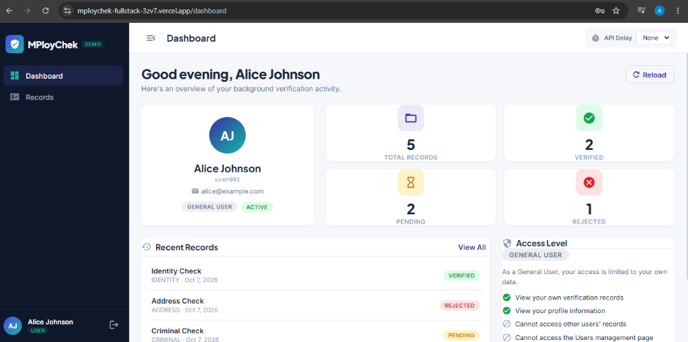

# MPloyChek — Background Verification Platform (Demo)

A full-stack Angular + Express demo application for a background-verification platform. Built as a coding challenge to demonstrate role-based access control, async loading patterns, and a clean modular architecture.

> **Live Demo**
> - 🌐 Frontend: `https://mploychek-fullstack-3zv7.vercel.app`
> - 🔌 API: `https://mploychek-fullstack.vercel.app/api/health`



---

## Tech Stack

| Layer       | Technology              | Why                                                                                     |
|-------------|-------------------------|-----------------------------------------------------------------------------------------|
| Frontend    | **Angular 19** (NgModule) | Mature framework with built-in DI, routing, guards, interceptors, and Material UI       |
| UI Library  | **Angular Material**    | Consistent, accessible components (tables, dialogs, snackbars, form fields)             |
| Styling     | **SCSS + CSS Variables** | Design tokens for theming (indigo/teal palette, Plus Jakarta Sans + Inter fonts)        |
| Backend     | **Express 5 + TypeScript** | Lightweight, well-understood REST API with full type safety                          |
| Database    | **MongoDB Atlas + Mongoose** | Flexible document schema for users/records; Atlas for zero-ops cloud hosting        |
| Auth        | **JWT (jsonwebtoken)**  | Stateless auth — token in `localStorage`, validated per request via middleware           |
| Deployment  | **Vercel (both)**       | Free tier hosts Angular static build + Express as serverless functions                  |

---

## Architecture

```
┌─────────────────────────────────────────────────────────────────┐
│                         BROWSER                                 │
│  ┌───────────┐  ┌───────────┐  ┌───────────┐  ┌─────────────┐  │
│  │   Login    │  │ Dashboard │  │  Records  │  │ Users(Admin)│  │
│  │  Module    │  │  Module   │  │  Module   │  │   Module    │  │
│  └─────┬─────┘  └─────┬─────┘  └─────┬─────┘  └──────┬──────┘  │
│        │               │              │               │         │
│  ┌─────┴───────────────┴──────────────┴───────────────┴──────┐  │
│  │                    Core Module                             │  │
│  │  AuthService · UserService · RecordService · DelayService  │  │
│  │  AuthGuard · RoleGuard · AuthInterceptor · ErrorInterceptor│  │
│  │  APP_INITIALIZER (session rehydration)                     │  │
│  └────────────────────────┬───────────────────────────────────┘  │
│                           │  HTTP + JWT Bearer                   │
└───────────────────────────┼──────────────────────────────────────┘
                            │
                   ┌────────┴────────┐
                   │   Express API   │
                   │  (?delay=ms)    │
                   ├─────────────────┤
                   │ Middleware:      │
                   │  cors · json    │
                   │  delay · auth   │
                   │  requireRole    │
                   │  errorHandler   │
                   ├─────────────────┤
                   │ Routes:         │
                   │  /api/auth/*    │
                   │  /api/records   │
                   │  /api/users/*   │
                   └────────┬────────┘
                            │
                   ┌────────┴────────┐
                   │  MongoDB Atlas  │
                   │  (Users, Recs)  │
                   └─────────────────┘
```

### Folder Structure

```
mploychek-fullstack/
├── api/                          # Express backend
│   ├── src/
│   │   ├── config/               # env.ts, db.ts
│   │   ├── controllers/          # auth, users, records
│   │   ├── middleware/           # auth, requireRole, delay, errorHandler
│   │   ├── models/              # Mongoose: User, Record
│   │   ├── routes/              # auth, users, records
│   │   ├── seed/                # seed.ts — populates demo data
│   │   ├── app.ts               # Express app (exported for serverless)
│   │   └── server.ts            # Standalone entry point
│   ├── tests/                   # Jest + Supertest integration tests
│   ├── api-entry.ts             # Vercel serverless handler
│   └── vercel.json              # Vercel routing config
│
├── web/                          # Angular frontend
│   ├── src/
│   │   ├── app/
│   │   │   ├── core/            # Singleton services, guards, interceptors, models
│   │   │   ├── shared/          # AsyncViewComponent, StatusBadge, PageHeader
│   │   │   ├── layout/          # ShellComponent (sidebar + toolbar), NotFound
│   │   │   └── features/
│   │   │       ├── auth/        # Login page (lazy-loaded)
│   │   │       ├── dashboard/   # Dashboard with parallel async loading (lazy)
│   │   │       ├── records/     # Records table with filters (lazy)
│   │   │       └── users/       # Admin user management + dialogs (lazy)
│   │   ├── environments/        # environment.ts / environment.prod.ts
│   │   └── styles.scss          # Global design tokens + Material overrides
│   └── vercel.json              # SPA rewrite rules
```

---

## Features (Challenge Requirements)

| #  | Requirement                                     | Implementation                                                                |
|----|--------------------------------------------------|-------------------------------------------------------------------------------|
| 1  | Login with role selection                        | Login page with role dropdown (`ADMIN` / `GENERAL_USER`); role validated server-side |
| 2  | Dummy API with persistent storage                | Express REST API backed by MongoDB Atlas with Mongoose schemas                |
| 3  | User details page                                | Dashboard shows profile card (avatar, name, userId, email, role, status chips)|
| 4  | Records table with access levels                 | `MatTable` with sort + pagination; Admin sees all records, User sees own only |
| 5  | Admin user management                            | Full CRUD: Add/Edit via Material dialog, Deactivate/Reactivate with confirm   |
| 6  | `?delay=ms` query parameter                      | Delay middleware on all `/api` routes; clamped 0–10 000 ms; UI delay control  |
| 7  | Async loading states                             | `<app-async-view>` component + `withLoadState()` RxJS operator → skeleton/error/empty |
| 8  | `UserService` for API communication              | `AuthService`, `UserService`, `RecordService`, `DelayService` in `core/services/` |
| 9  | `APP_INITIALIZER` session restore on app load    | `CoreModule` uses `APP_INITIALIZER` to call `GET /me` and rehydrate session   |
| 10 | Modular lazy-loaded architecture                 | Four feature modules (`auth`, `dashboard`, `records`, `users`) loaded via `loadChildren` |

---

## API Reference

All routes (except `/api/health`) accept an optional `?delay=<ms>` query parameter (clamped to 10 000 ms max) to simulate network latency.

| Method   | Path               | Auth        | Description                                     |
|----------|--------------------|-----------  |--------------------------------------------------|
| `GET`    | `/api/health`      | —           | Health check (bypasses delay middleware)          |
| `POST`   | `/api/auth/login`  | —           | Login with `{ userId, password, role }` → JWT    |
| `GET`    | `/api/auth/me`     | Bearer      | Get current authenticated user's profile         |
| `GET`    | `/api/records`     | Bearer      | Get records (Admin: all; User: own `ownerUserId`)|
| `GET`    | `/api/users`       | Admin       | List all users (supports `?search=` `?status=`)  |
| `GET`    | `/api/users/:id`   | Admin       | Get single user by userId                        |
| `POST`   | `/api/users`       | Admin       | Create user `{ userId, name, email, password, role, status }` |
| `PUT`    | `/api/users/:id`   | Admin       | Update user fields (password optional)           |
| `DELETE` | `/api/users/:id`   | Admin       | Soft-delete (sets status to `INACTIVE`)          |

---

## Setup Instructions

### Prerequisites

- Node.js ≥ 18
- npm ≥ 9
- A MongoDB instance (local or [MongoDB Atlas](https://www.mongodb.com/atlas))

### 1. Clone

```bash
git clone https://github.com/RuinPrince/mploychek-fullstack.git
cd mploychek-fullstack
```

### 2. API Setup

```bash
cd api
npm install
```

Create a `.env` file:

```env
PORT=3000
MONGO_URI=mongodb://localhost:27017/mploychek   # or your Atlas connection string
JWT_SECRET=your-secret-key
JWT_EXPIRES_IN=7d
CORS_ORIGIN=http://localhost:4200
```

Seed the database with demo data:

```bash
npm run seed
```

Start the dev server:

```bash
npm run dev          # runs on http://localhost:3000
```

### 3. Web Setup

```bash
cd web
npm install
```

> **Note:** For local development, update `src/environments/environment.ts` to point `apiBaseUrl` to `http://localhost:3000/api`.

Start the dev server:

```bash
npm run start        # runs on http://localhost:4200
```

### 4. Run Tests

```bash
# API integration tests (Jest + Supertest)
cd api && npm test

# Web unit tests (Karma + Jasmine)
cd web && npm test
```

---

## Seeded Demo Credentials

| Role           | User ID    | Email                  | Password   |
|----------------|------------|------------------------|------------|
| **ADMIN**      | `admin001` | admin@mploychek.com    | `Admin@123`|
| GENERAL_USER   | `user001`  | alice@example.com      | `User@123` |
| GENERAL_USER   | `user002`  | bob@example.com        | `User@123` |
| GENERAL_USER   | `user003`  | carol@example.com      | `User@123` |
| GENERAL_USER   | `user004`  | dave@example.com       | `User@123` |
| GENERAL_USER   | `user005`  | eve@example.com        | `User@123` |

The seed script also creates **28 verification records** (Criminal, Address, Education, Employment types) distributed across users with mixed statuses.

---

## Design Decisions

**Why `NgModule` over standalone components?**
The challenge explicitly calls for a modular architecture. `NgModule` makes the lazy-loaded feature boundaries (`AuthModule`, `DashboardModule`, `RecordsModule`, `UsersModule`) explicit and easy to reason about. `CoreModule` uses the `@SkipSelf()` guard pattern to enforce singleton status.

**Why `APP_INITIALIZER` for session restore?**
Without it, refreshing a page while authenticated would flash the login screen before route guards resolved. The initializer calls `GET /api/auth/me` synchronously at boot, so `AuthGuard` always has user state before deciding.

**Why a custom `withLoadState()` operator?**
Every async view needs three states: loading, success, error. Instead of duplicating `isLoading` / `error` / `data` booleans across every component, a single RxJS operator wraps any `Observable<T>` into `Observable<LoadState<T>>`, and `<app-async-view>` renders the skeleton, content, or error+retry UI declaratively.

**Why `?delay=ms` as a query parameter (not a header)?**
Query parameters are visible in the browser network tab and easily tweakable from the Angular UI's delay dropdown. The middleware clamps to 10 seconds to prevent abuse.

**Why separate Vercel projects for API and Web?**
Vercel's free tier supports both serverless functions (Express API via `@vercel/node`) and static hosting (Angular build output) at zero cost. Keeping them separate gives each project its own deployment pipeline, logs, and environment variables.

---

## License

This project was built as a coding challenge submission and is not licensed for production use.
